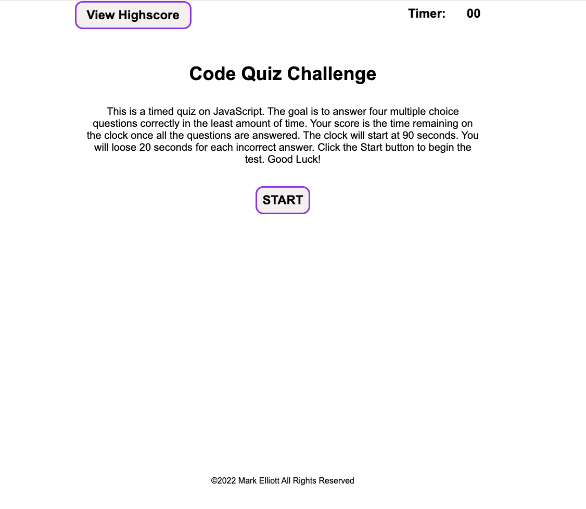

# Code Quiz Challenge>

## Description

This is a timed quiz on JavaScript code:

- This purpose of this project is to reinforce JavaScript coding skills by:
    - actually implementing a challenging JavaScript application and
    - by indentifing areas of weakness in JavaScript that need more study.

## Installation

As this is a web application, there is no installation per se.   You just run the application from this URL: https://melliott7264.github.io/code-quiz/
However, this applicaton does save high scores to the "scores" file under  Local Storage on the browser.  If you want to delete the scores file, open the Developer Tools (alt-command-i on a Mac ) go to the Application tab, locate the file "scores" under Local Storage and delete it.

## Usage

You just run the application from this URL: https://melliott7264.github.io/code-quiz/.  Click on the Start button to begin.   The quiz gives you 90 seconds to answer six unique questions.  The time left on the timer after you have answered all the questions is your score.  You loose 10 seconds for each wrong answer.

At the conclusion of a game, if this is the first time you played or you beat your previous highscore, you are presented with a screen to enter you initials in order to save your score.   Just type in your intitials and click the Submit button.  Initials are case-sensitive.

You can click on the View Highscore button at any time, but the Clear High Score button will only work once you complete a game and enter a set of initials.   The highscore for the last initials entered are deleted.  Click on the ReStart button to start another game.

  

   

## Credits

Mark Elliott  https://github.com/melliott7264    Link to development code: https://github.com/melliott7264/code-quiz

The quiz questions came from the Boot Camp async lessons and from w3schools.com quizes.

## License

Copyright (c) 2022 Mark Elliott

Permission is hereby granted, free of charge, to any person obtaining a copy
of this software and associated documentation files (the "Software"), to deal
in the Software without restriction, including without limitation the rights
to use, copy, modify, merge, publish, distribute, sublicense, and/or sell
copies of the Software, and to permit persons to whom the Software is
furnished to do so, subject to the following conditions:

The above copyright notice and this permission notice shall be included in all
copies or substantial portions of the Software.

THE SOFTWARE IS PROVIDED "AS IS", WITHOUT WARRANTY OF ANY KIND, EXPRESS OR
IMPLIED, INCLUDING BUT NOT LIMITED TO THE WARRANTIES OF MERCHANTABILITY,
FITNESS FOR A PARTICULAR PURPOSE AND NONINFRINGEMENT. IN NO EVENT SHALL THE
AUTHORS OR COPYRIGHT HOLDERS BE LIABLE FOR ANY CLAIM, DAMAGES OR OTHER
LIABILITY, WHETHER IN AN ACTION OF CONTRACT, TORT OR OTHERWISE, ARISING FROM,
OUT OF OR IN CONNECTION WITH THE SOFTWARE OR THE USE OR OTHER DEALINGS IN THE
SOFTWARE.

---
